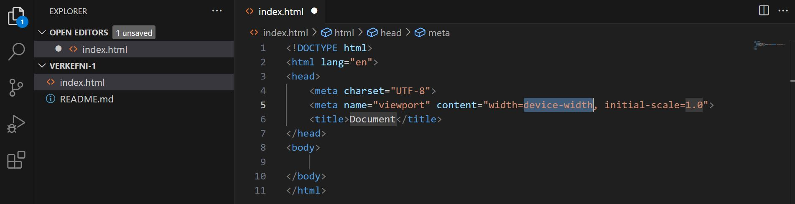

# HTML og CSS 

### Markmið:

Nemendur geta:

- stofnað vefumsjónarkerfi með Visual Studio Code
- búið til HTML5 vefsíðu 
- sótt viðbótina _Live Server_ (_extension_) og skoðað vefsíðuna í vafra (_localhost_)
- búið til HTML vefsíðu og nota HTML ívafsmálið til að gera texta læsilegan
- hannað útlit vefsíðunnar með CSS stílum

---

### Innsetning forrits og uppsetning vefþróunarsvæðis

1. Byrjum á að hlaða inn [Visual Studio Code](https://code.visualstudio.com/) og setjum það inn (_install_) í tölvuna okkar

---

### 1.1 Vefþróunarsvæði

1. Opnaðu Visual Studio Code (VSC), veldu **"File -> "Open folder"** og vísaðu VSC á Verkefnamöppu þar sem þú ætlar að vista öll gögn sem unnin eru í áfanganum
1. Í VSC búðu til möppu og nefnu hana **"Verkefni-1"** og í þá möppu, HTML vefsíðu sem á að nefna _index.html_ veldu **"File -> "New file"**
```
  VEFÞ1-verkefni
  |_verkefni-1
    |_index.html
```
### 1.2 HTML

VSC styður fjölmörg forritunarmál og HTML skrár eru studdar dyggilega af VSC forritinu

1. index.html skráin sem þú hefur búið til er alveg auð en VSC er tilbúið með flýtileið til að stofna grunnkóða HTML (_boilerplate_), það eina sem þú þarft að gera er að slá inn `!` og síðan ýtir þú á `enter` eða `tab` takkann á lyklaborðinu þínu

 

1. Í möppunni [Námsefni-1](Namsefni-1/verkefni-1-texti.md) er texti sem þú getur notað í HTML vefsíðunni.
1. Settu viðeigandi HTML tög utan um textann til að gera hann læsilegan
1. Vandaðu frágang og notaðu tab lykilinn á lyklaborðinu til að búa til viðeigandi bil í HTML kóðann.  

```
<H1> til <H6>, <p>, <em>, <strong>, <sub>, <sup>, <ul>, <ol>, <li>, <pre>, <br>, <hr> <blockqoute> og <span> 
```
- [Skoða sýnidæmi](Namsefni-1/Synidaemi/README.md)

### 1.3 CSS

Búðu til stílsíðu (_Cascading Style Sheet_) og tengdu hana við html síðuna. Settu stíla á tögin.  Heildarbreidd vefsíðunnar getur verið 1280px og hún á að vera miðjusett í skjáum sem eru stærri en 1280px. Notaðu eftirfarandi CSS skipanir í stílsíðunni:

```CSS
color:; text-decoration:; font-family:; font-style:; font-weight:; border:; margin:; padding:;  
```
Á **a** tagið bætir þú við huldu-klösum (_pseudo class_) þeir eru skráðir með eftirfarandi hætti:

```CSS

  a:link {skipun:gildi;}
  a:visited {skipun:gildi;}
  a:hover {skipun:gildi;}
  a:active {skipun:gildi;}

```

### Námsmat 10% af heildareinkunn

#### Æfingaverkefni

- 1.1 HTML 
- 1.2 CSS 

### Verkefnaskil

- Setjið æfingaverkefni í **.zip skrá** og skilið í verkefni 1 í INNU.

#### Einkunn verður birt í Innu

#### [Námsefni](https://github.com/vefgrunnur/24H-verkefni/tree/main/Verkefni-1/Namsefni-1)

