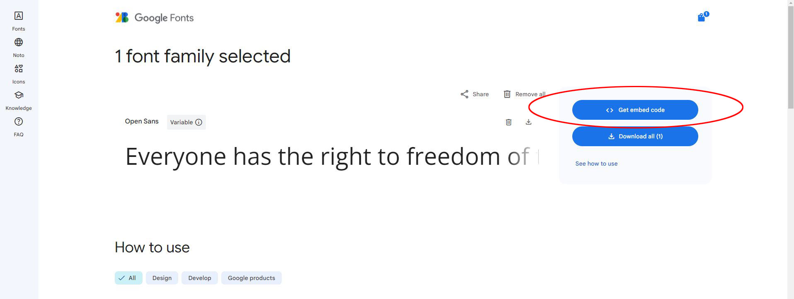

# Leturgerð sótt af fonts.google.com

1. Veljið leturgerð sem þið viljið nota
    - 
1. Smellið á **"Get font"**
    - 
1. Smellið á **"Get embed code"**
    - 
1. Afritið kóðann í **HTML head** og **CSS**
    - 
1. Leturgerð í CSS
    - 