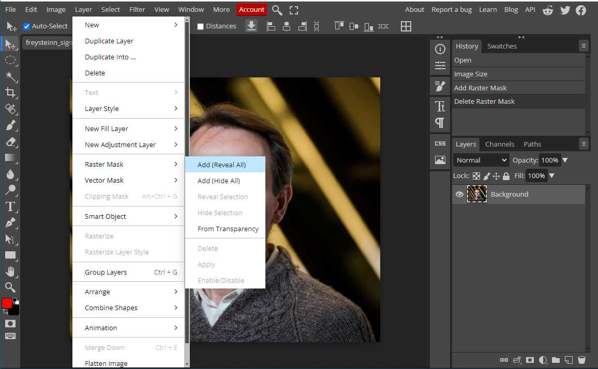
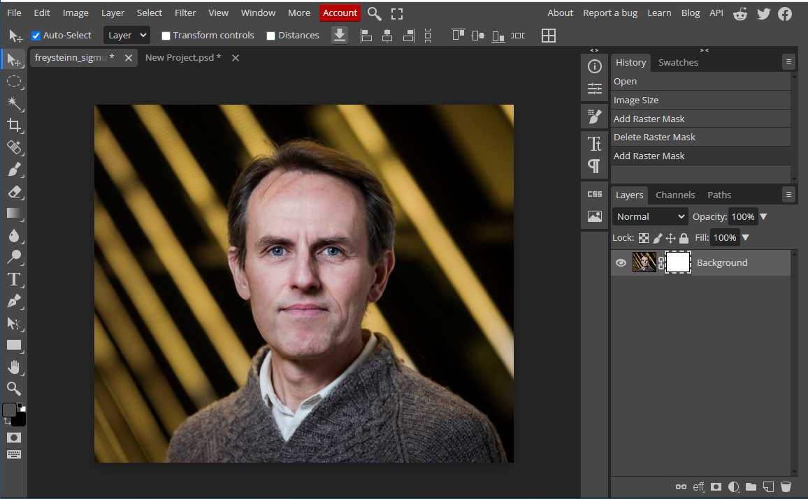
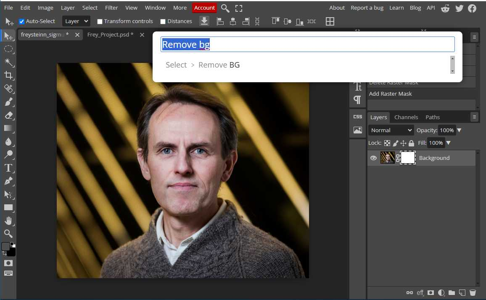
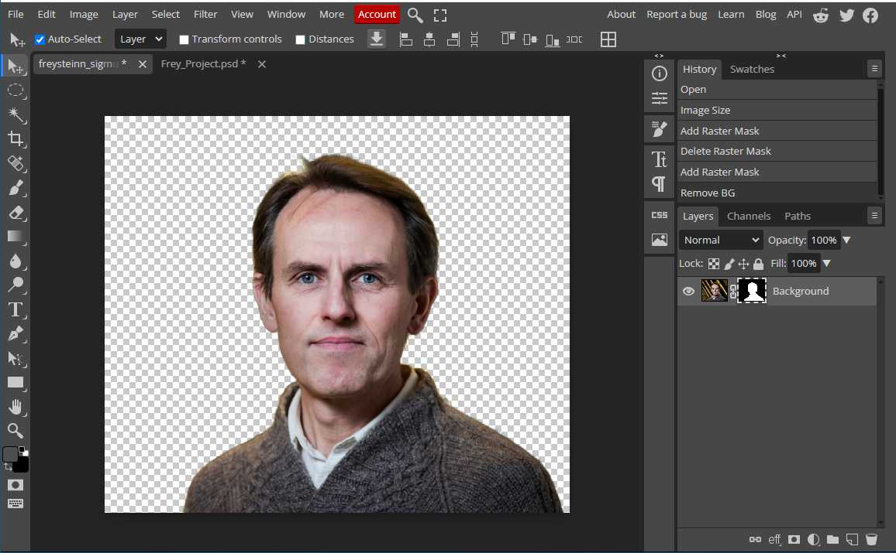

# Myndvinnsla

### Bakgrunnur tekin úr mynd

1. Búðu til _"Raster Mask"_ 
   * valslá -> _"Raster Mask"_ -> _"Add (Reveal all)"_  
    
   * sláðu á lyklaborðið `Control` + `f`  
    
   * Skrifaðu _"Remove"_ í innsláttareitinn og veldu _"Remove BG"_  
    
   * Þá hreinsar forritið bakgrunninn út  
    
2. Vistaðu síðan myndina sem .png skrá 
    * Valslá -> _"File"_ -> _"Export as"_ -> **.png**

### Bakgrunnur skyggður

Til að draga fram persónu frá bakgrunninum er hægt að dekkja bakgrunninn með eftirfarandi hætti

1. Mynd opnuð í Photopea
    * veljið _Lasso_ í tólastikunni 
    * stillið _Feather_ á 30px í valslá
    * dragið Lassó tólið utanum Benedikt
    * 
1. Veljið _Select_ í valslá og síðan **_Inverse_**
    * 
1. Veljið _Image_ í valslá síðan > _Adjustment_ > **_Curves_**
    * 
1. Smellið í miðju línunnar í Curves myndinni og dragið hana niður eins og sýnt er á mynd og síðan á OK
    * 
1. Veljið _Crop_ tólið í tólastikunni og skerið myndina eins og sýnt er á mynd og smallið síðan á **V** í valslánni
    * 
1. Vistið myndina > **_File > Export as > JPG_**
    * 
1. Breidd myndar á að vera 600px > 
    *   