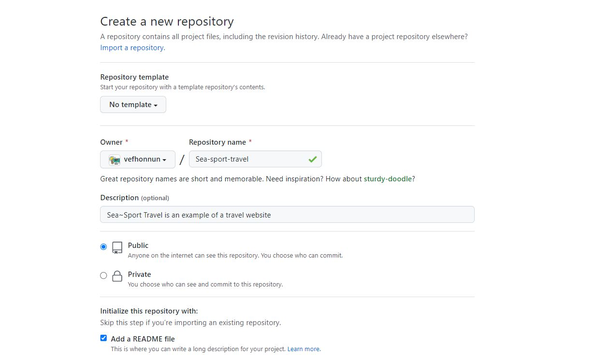
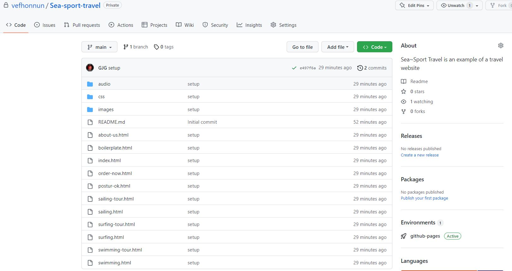
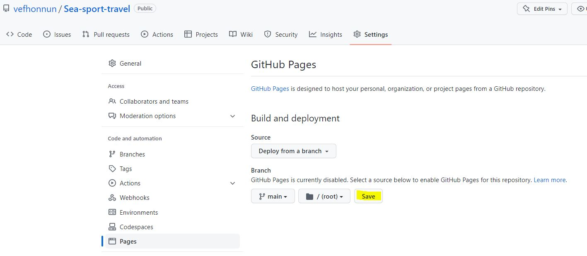
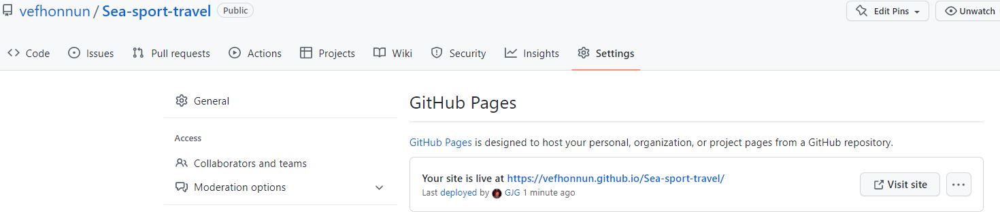
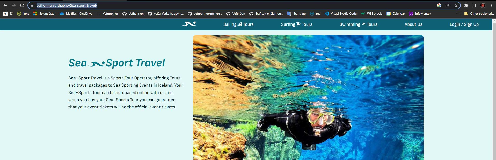

# Uppsetning vefsíðu á (notandi).github.io  

Github býður viðskiptavinum sínum að búa til vef sem tengist reikningi þeirra. Eina sem þarf að gera er að virkja veftenginguna í Github notendastillingum (Settings). 

dæmi:  
1.	Notendanafn (_Username_) á Gitub reikningi: **Notandi** 
1.	heiti geymslu (_Repository_): **notandi.github.io**
1.	Í notandi.github.io geymslunni -> valslá -> **Settings** -> **Pages**, þar velur þú `Branch`: **_Main_**. 
1.	Github býr til tengingu á milli geymslunnar og vefhýsingarinnar á github.io 
1.	Nú getur þú birt verkefnin þín á eigin vefsíðu.

---

## Undirlén (_Subdomain_)

Ef við viljum búa til undirlén (_subdomain_) sem er með öðru skipulagi og útliti en er á _notandi.github.io_ þá er það tiltölulega einfalt mál. 

#### Dæmi

1. Stofnaðu geymslu og nefndu hana nafni verkefnisins sem þú ætlar að birta
    * 
    * Heiti geymslunnar má **ekki** vera með íslenskum stöfum eða með bil í nafninu
1. Náðu í geymsluna `$ git clone ` og settu vefinn sem þú ætlar að birta í geymsluna. 
1. Uppfærðu geymsluna á Github.com `$ git push `
    * 
1. Efst í geymslunni á Github.com er valslá, veldu _Settings_ og síðan _Pages_ úr hliðardálknum
    * 
1. Hér getur þú valið geymsluna sem rót á undirléni
1. Eftir smá stund (2-3 mínútur) getur þú endurhlaðið (_refresh_)  Settings síðuna
    * 
1. smelltu á tengilinn og skoðaðu vefinn inn
    * 

#### [Dæmi um undirlén](https://vefhonnun.github.io/sea-sport-travel/)
